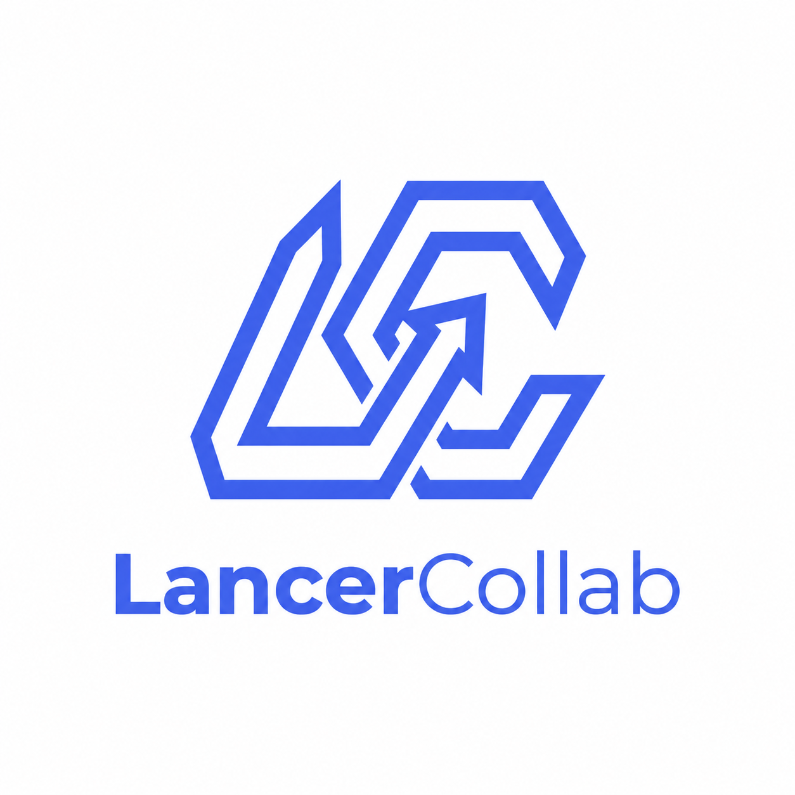
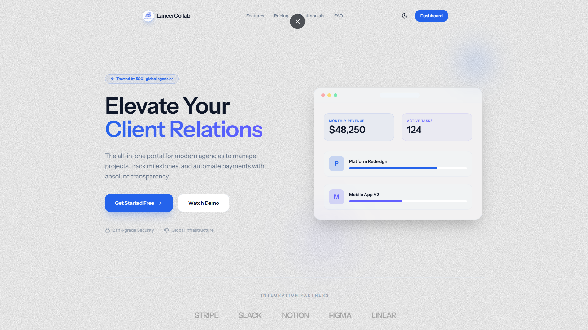
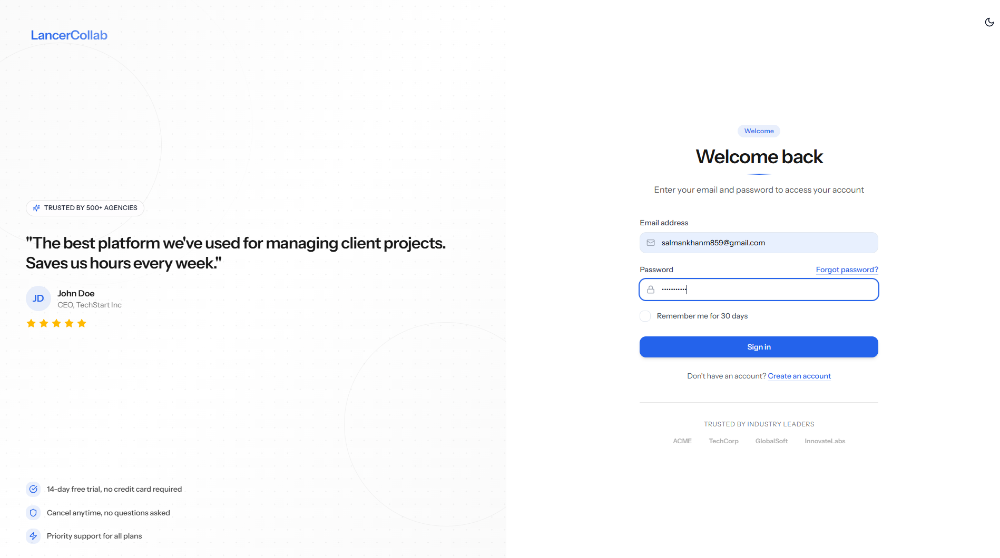
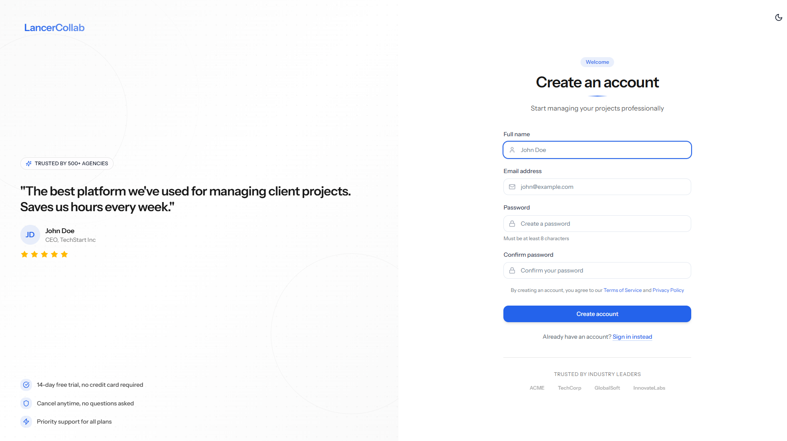
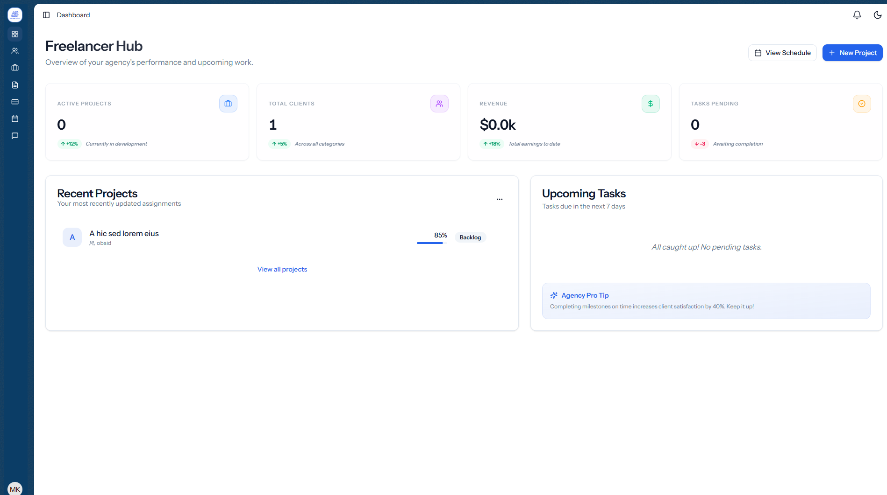
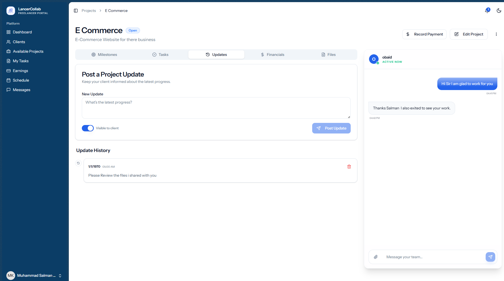
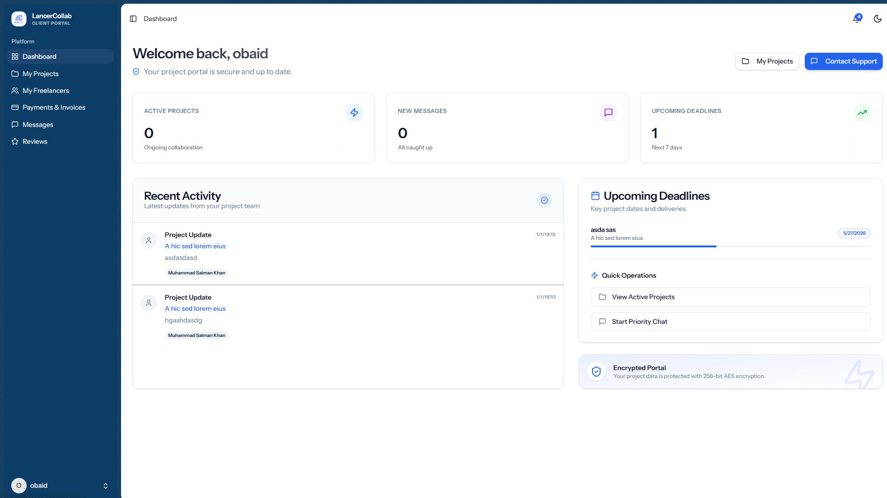
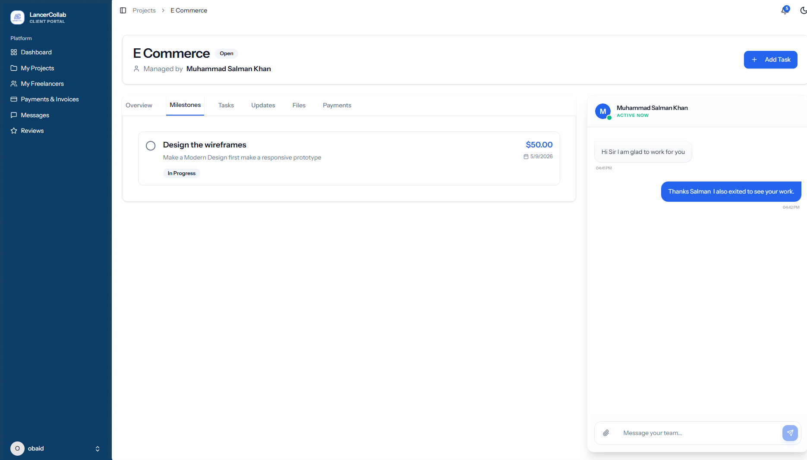

<div align="center">
  
</div>

# LancerCollab

**Enterprise-Grade Client Collaboration Platform for Freelancers & Agencies**

LancerCollab is a comprehensive, multi-tenant SaaS platform designed to streamline client-facing project management. It enables freelancers, agencies, and creative teams to deliver exceptional client experiences through dedicated portals, real-time collaboration, and automated workflows — all without building custom infrastructure.

## Screenshots

### Landing & Authentication
| Landing Page | Sign In | Sign Up |
| :---: | :---: | :---: |
|  |  |  |

### Freelancer / Agency Portal
| Dashboard | Project View |
| :---: | :---: |
|  |  |

### Client Portal
| Dashboard | Project View |
| :---: | :---: |
|  |  |

## Architecture & Technology Stack

- **Backend:** Laravel (PHP)
- **Frontend:** React 18
- **Bridge:** Inertia.js
- **Styling:** Tailwind CSS + Shadcn UI
- **Database:** MySQL / PostgreSQL

## Core Features

- **Multi-tenant Architecture:** Isolated dashboards and access levels for Admins, Freelancers, and Clients.
- **Client Management (CRM):** Centralized directory, Magic Link onboarding, preference management.
- **Project & Milestone Tracking:** Deliverable breakdown, budget variance, visual project cards.
- **Financial & Payment Module:** Payment tracking, budget consumption alerts.
- **Real-time Collaboration:** Threaded messaging, secure file sharing, activity feeds.
- **Security & Compliance:** Audit logs, passwordless token expiry, and strict data isolation.

## User Roles

1. **Admin (`/admin`):** Global platform oversight, user management, and system configuration.
2. **Freelancer/Agency (`/freelancer`):** Client and project management, milestone tracking, and financial reporting.
3. **Client (`/client`):** Project viewing, milestone approval, file access, and messaging.

## Installation

1. **Clone the repository:**
   ```bash
   git clone <repository-url>
   ```
2. **Install dependencies:**
   ```bash
   composer install
   npm install
   ```
3. **Environment Setup:**
   ```bash
   cp .env.example .env
   php artisan key:generate
   ```
4. **Database & Migrations:**
   ```bash
   php artisan migrate --seed
   ```
5. **Run the application:**
   ```bash
   php artisan serve
   npm run dev
   ```
